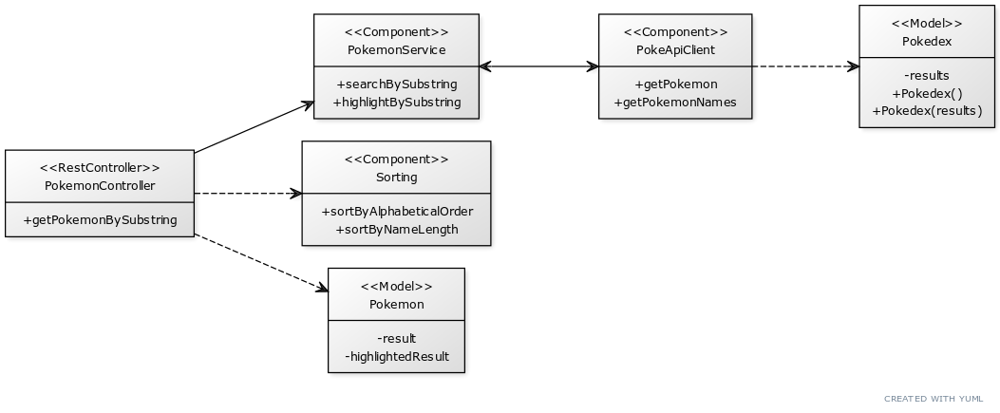

# PokeApi Microservice Challenge

> [looqbox-backend-challenge](https://github.com/looqbox/looqbox-backend-challenge)

## Class Diagram



## Run the project locally

* clone this repo
  
* build and run the Docker image

## Usage

GET /pokemon

Params:

* q -> find matching pokemon by substring
* sort(optional) -> sort **results** by **alphabetical** (order) **or** (name) **length**


## Examples

> running on port 8080

### Request

`GET /pokemon?q=pi`

### Response

```{"result":["caterpie","pidgey","pidgeotto","pidgeot"],"highlightedResult":[{"name":"caterpie","start":5,"end":7},{"name":"pidgey","start":0,"end":2},{"name":"pidgeotto","start":0,"end":2},{"name":"pidgeot","start":0,"end":2}]}```

### Request

`GET /pokemon?q=pi&sort=alphabetical`

### Response

```{"result":["caterpie","pidgeot","pidgeotto","pidgey"],"highlightedResult":[{"name":"caterpie","start":5,"end":7},{"name":"pidgey","start":0,"end":2},{"name":"pidgeotto","start":0,"end":2},{"name":"pidgeot","start":0,"end":2}]}```
